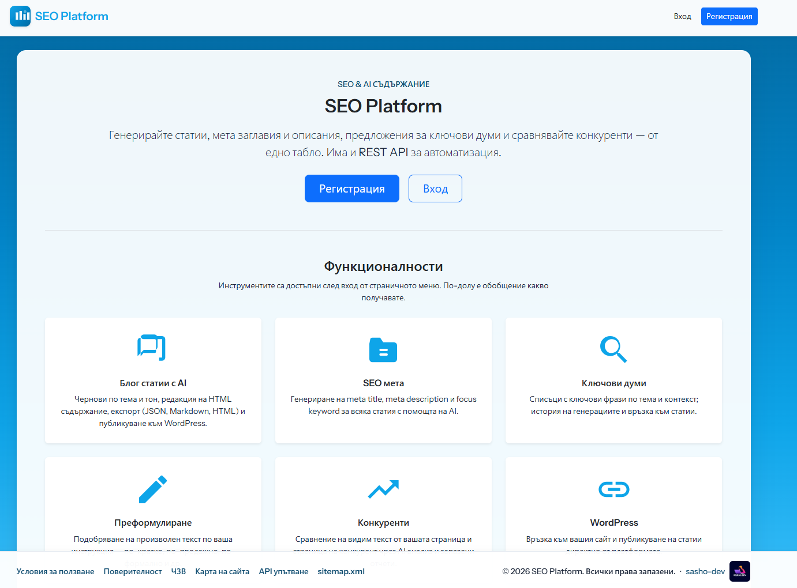
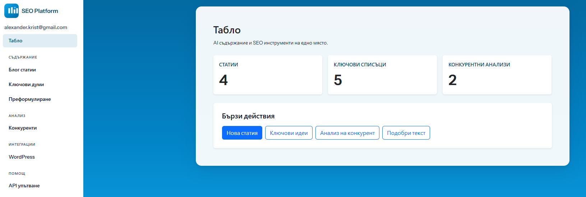
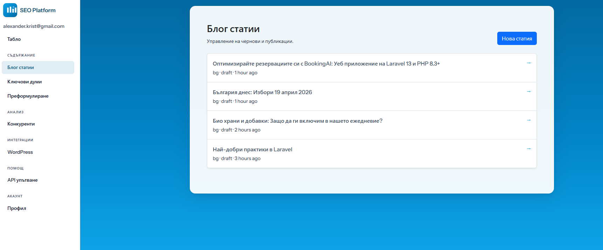
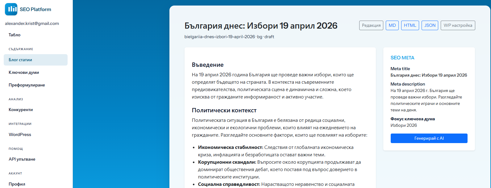
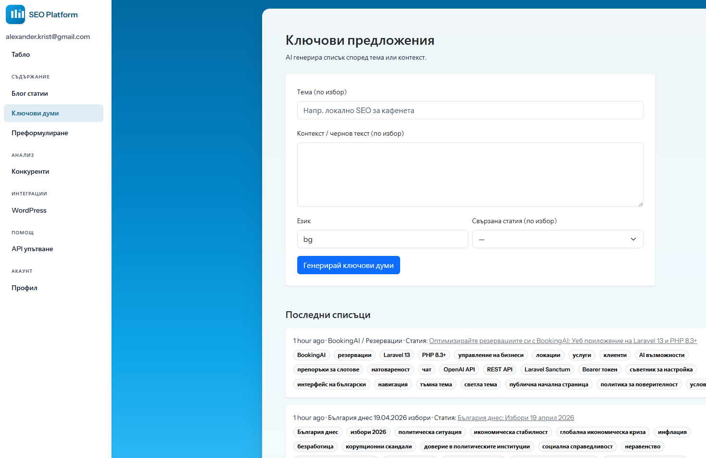
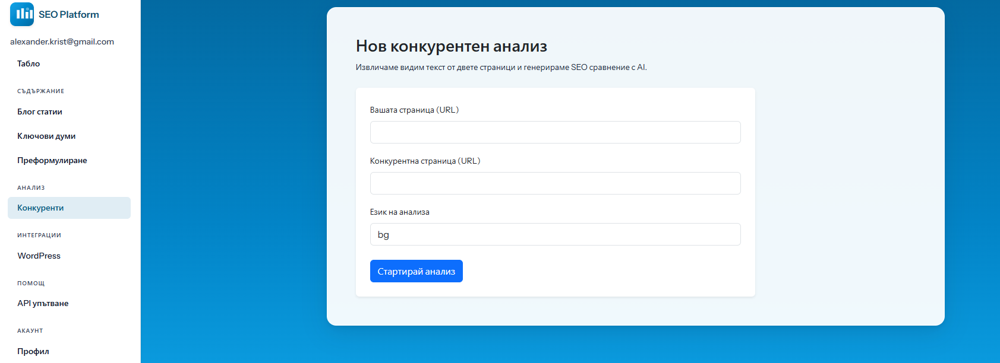
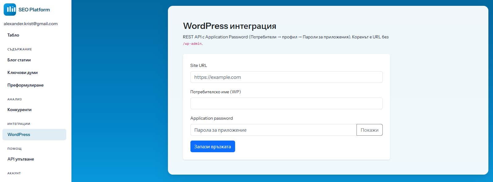
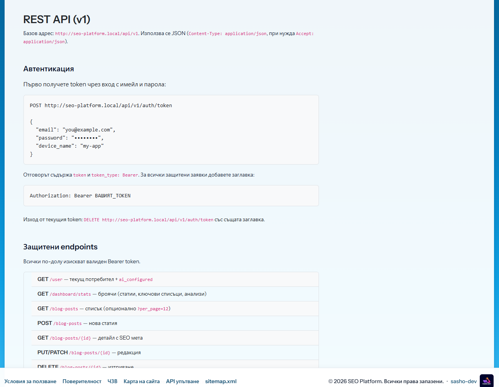

# SEO Platform

Уеб приложение за **SEO и AI съдържание**: генериране и управление на блог статии, SEO мета данни, ключови думи, преформулиране на текст, конкурентен анализ по URL и интеграция с WordPress. Включва **REST API** (`/api/v1`) с Laravel Sanctum.

**Стек:** Laravel 13, PHP 8.3, Laravel Sanctum, Bootstrap 5, Vite.

---

## Екранни снимки

Поставете файловете `1.png` … `8.png` в папка `public/images/` (в хранилището те се подават като статични ресурси под `/images/...`).

| | |
|---|---|
|  |  |
| Начало | Табло |
|  |  |
| Блог статии | Ключови думи |
|  |  |
| Преформулиране | Конкуренти |
|  |  |
| WordPress / интеграции | Профил / помощ |

Ако някой файл липсва, прегледът в GitHub ще покаже счупена картинка — добавете снимките локално преди push.

---

## Функционалности

- **Блог статии** — създаване и редакция на HTML съдържание; AI чернова по тема и тон; SEO мета (заглавие, описание, focus keyword); експорт (JSON, Markdown, HTML); история на публикации.
- **Ключови думи** — AI списъци по тема и контекст; връзка към статия; запазени последни генерации.
- **Преформулиране** — подобряване на текст по зададена инструкция и език (без задължителен запис в база в текущия UI).
- **Конкуренти** — извличане на видим текст от две URL страници и AI сравнителен анализ; запазени отчети.
- **WordPress** — запазване на връзка (сайт, потребител, application password) и публикуване на статии към REST API.
- **Профил** — име, аватар, смяна на парола, изтриване на акаунт.
- **Публични страници** — условия, поверителност, ЧЗВ, карта на сайта, cookie банер, SEO мета от конфигурация.

---

## REST API

- **Базов път:** `/api/v1`
- **Автентикация:** издайте token с `POST /api/v1/auth/token`, после подавайте заглавка `Authorization: Bearer {token}`.
- **Ресурси (обобщено):** потребител, табло (статистика), блог статии (CRUD, генериране, SEO, експорт), ключови думи, преформулиране, конкуренти, WordPress връзка и публикуване.

Пълен списък с методи и примери: уеб страницата **API упътване** в приложението (маршрут `/docs/api`, ако е включен) или прегледайте `routes/api.php`.

Имената на маршрутите в кода са с префикс `api.v1.*`, за да не се припокриват с уеб маршрутите.

---

## Изисквания

- PHP **8.3+** с разширения: `openssl`, `pdo`, `mbstring`, `tokenizer`, `xml`, `ctype`, `json`, `fileinfo`
- Composer 2
- Node.js **18+** и npm (за Vite / frontend ресурси)
- База данни: **MySQL** (или съвместима; по подразбиране проектът е настроен към MySQL в `.env.example`)

---

## Клониране

```bash
git clone <repository-url> seo_platform
cd seo_platform
```

---

## Инсталация

### 1. Зависимости и ключ

```bash
composer install
cp .env.example .env
php artisan key:generate
```

### 2. Конфигурация на `.env`

- **`APP_NAME`** — в `.env.example` по подразбиране е **SEO Platform** (съвпада с името на продукта).
- **`APP_URL`** — за коректни линкове и аватари задайте реалния публичен адрес (при WAMP подпапка напр. `http://localhost/seo_platform/public`).
- **База данни:** `DB_DATABASE`, `DB_USERNAME`, `DB_PASSWORD`, при нужда създайте базата ръчно.
- **OpenAI (за AI функции):** `OPENAI_API_KEY`. По желание: `OPENAI_MODEL`, `OPENAI_API_URL`.
- **SSL на Windows / локална среда:** при грешка `cURL error 60` може да ползвате `ssl/cacert.pem` и настройки `OPENAI_VERIFY_SSL` / `OPENAI_CACERT`, или изходящи `HTTP_VERIFY_SSL` / `HTTP_CACERT` (виж `.env.example`). За продукция предпочитайте валиден CA bundle, не изключване на проверка.

### 3. Миграции, сесии, опашка, storage

```bash
php artisan migrate
php artisan storage:link
```

Сесиите и кешът по `.env.example` могат да използват базата — след миграции таблиците се създават автоматично.

### 4. Frontend (Vite / Bootstrap)

```bash
npm install
npm run build
```

За разработка: `npm run dev` (и отделно `php artisan serve` или вашият виртуален хост).

### Автоматизирана първоначална настройка

```bash
composer run setup
```

Това инсталира Composer и npm зависимости, генерира ключ при липсващ `.env`, изпълнява миграции и `npm run build`. Проверете `.env` преди продукция.

**Стилове без `npm run build`:** ако липсва папка `public/build/` (не сте пуснали Vite на сървъра), приложението автоматично зарежда Bootstrap от CDN и локален файл `public/css/app-theme.css`. За най-добър резултат и един bundle с JS/CSS препоръчително е **`npm ci && npm run build`** след deploy.

---

## Разработка и качество на кода

```bash
composer run lint      # Laravel Pint
composer run analyse   # PHPStan
composer run test      # PHPUnit
composer run qa        # lint + analyse + audit + test
```

---

## Лиценз

Проектът ползва скелета на Laravel под [MIT лиценз](https://opensource.org/licenses/MIT). Допълненията към приложението следват същата рамка, освен ако не е указано друго.
